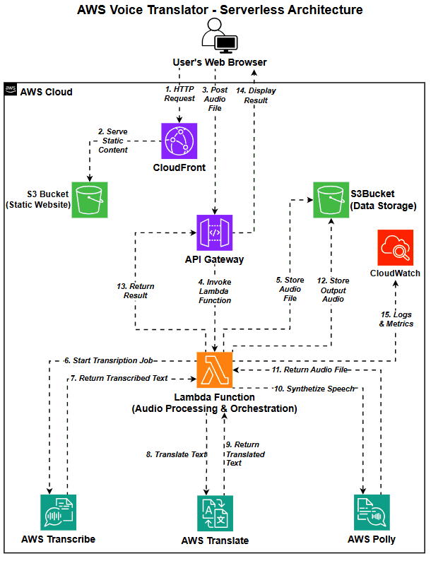
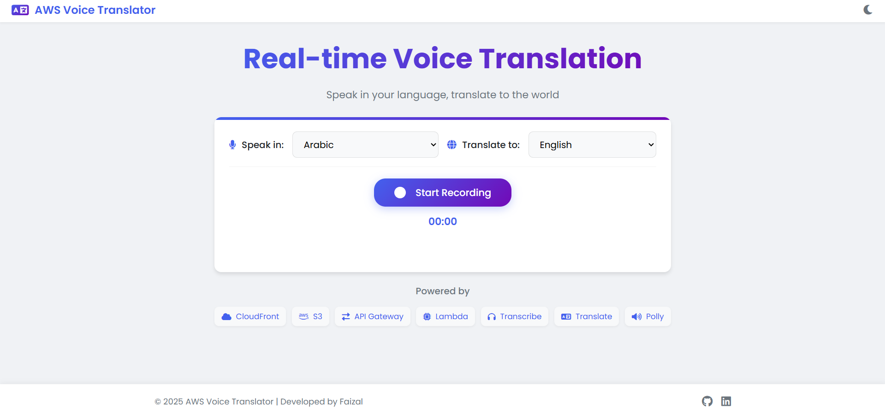
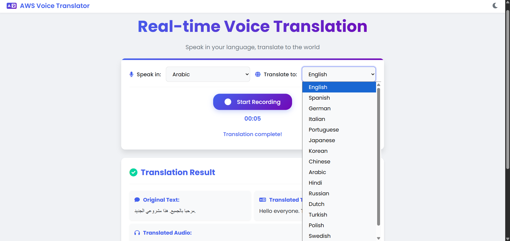
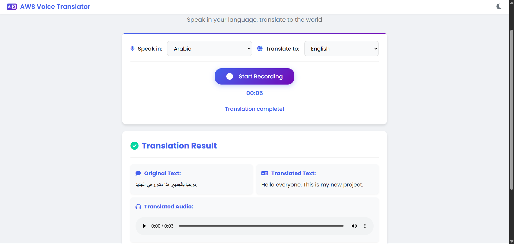
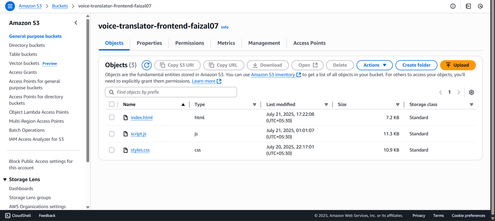
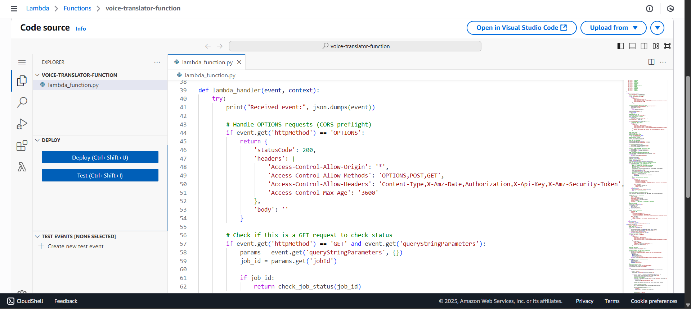
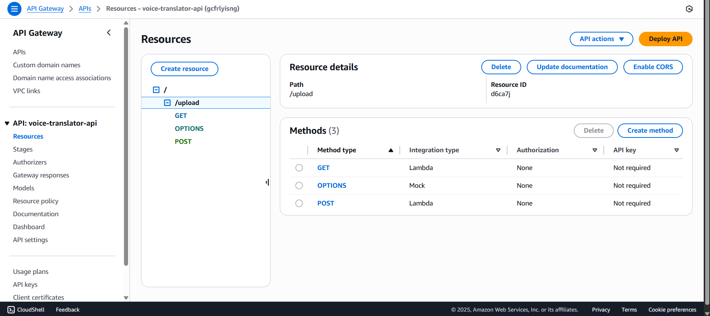
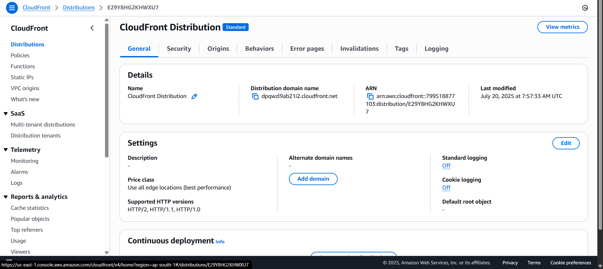

# AWS Voice Translator

A real-time voice translation web application built with AWS AI services.

## Features

- Record voice directly from the browser
- Support for 16 languages including English, Spanish, German, Hindi, and more
- Real-time transcription using Amazon Transcribe
- Text translation using Amazon Translate
- Text-to-speech conversion using Amazon Polly
- Responsive design for desktop and mobile devices

## Demo

Visit the live demo: [AWS Voice Translator](https://dpqwzl9ab21i2.cloudfront.net/)

## Architecture

This application uses a serverless architecture with the following AWS services:

- **Amazon S3**: Hosts the static website and stores audio files
- **Amazon CloudFront**: Delivers the frontend with low latency
- **Amazon API Gateway**: Provides REST API endpoints
- **AWS Lambda**: Processes audio and orchestrates the translation workflow
- **Amazon Transcribe**: Converts speech to text
- **Amazon Translate**: Translates text between languages
- **Amazon Polly**: Converts translated text back to speech
- **Amazon CloudWatch**: Monitors and logs application activity

## How It Works

1. User selects source and target languages
2. User records audio through the browser
3. Audio is sent to API Gateway and processed by Lambda
4. Lambda uses Transcribe to convert speech to text
5. Lambda uses Translate to translate the text
6. Lambda uses Polly to convert the translated text to speech
7. Results are displayed to the user

## Technologies Used

- **Frontend**: HTML, CSS, JavaScript
- **Backend**: Python (AWS Lambda)
- **AWS Services**: S3, CloudFront, API Gateway, Lambda, Transcribe, Translate, Polly, CloudWatch

## Screenshots

### Application UI

### AWS Configuration

## Setup and Deployment

### Prerequisites
- AWS Account
- Basic understanding of AWS services
- Web browser with microphone access

### Deployment Steps
1. Create an S3 bucket for hosting the website
2. Upload frontend files to the S3 bucket
3. Configure S3 for static website hosting
4. Create a CloudFront distribution
5. Create an API Gateway REST API
6. Create a Lambda function with the provided code
7. Configure necessary IAM permissions
8. Deploy and test the application

## License

This project is licensed under the MIT License.

## Author

Developed by [Faizal Shaikh](https://github.com/faizdev07)

Connect with me on [LinkedIn](https://www.linkedin.com/in/faizalshaikh-pro)